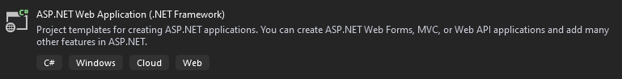
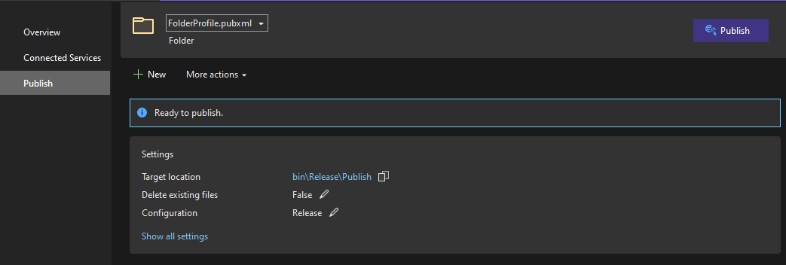

# Using Github Actions for ASP.Net MVC apps

## Intro
In my current company I had to introduce a minimal approach to DevOps practices. The first step was to create pipeline to automate the release og an ASP.Net MVC app (.NET Framework) to staging environment.

The repo code is on GitHub and I choose to try the GitHub Actions. In the past I had used the Azure DevOps tool, GitHub has some identical principles but others no.

In this post I want to illustrate to create a pipeline to compile a ASP.Net MVC app (but it is simililar for .NET Core projects).

### Create a simple app



### Create publish profile

To make this simple I've created a Visual Studio Folder profile:



### Create a new a GitHub Actions

```yaml
name: MVC App

on:
  push:
    branches: [ master ]

jobs:
  build:
    runs-on: windows-latest

    steps:
      - name: Checkout Code
        uses: actions/checkout@v2
        
      - name: Setup MSBuild
        uses: microsoft/setup-msbuild@v1
      
      - name: Setup NuGet
        uses: NuGet/setup-nuget@v1.0.2
        
      - name: Restore Packages
        run: nuget restore .\app.sln
        
      - name: Build and Publish Web App
        run: |
          msbuild .\app.sln /p:Configuration=Release /p:DeployOnBuild=true /p:PublishProfile=FolderProfile

      - name: Upload Artifact
        uses: actions/upload-artifact@v2
        with:
          name: artifacts
          retention-days: 1

  release:
    needs: [ build ]
    runs-on: web
    
    steps:
      - name: Download a single artifact
        uses: actions/download-artifact@v2
        with:
          name: artifacts
```

The pipeline has two jobs: a build and release job. It starts when a push is made on master branch.
The build job runs on GitHub agent, the release agent runs on on-promise agent on staging service.
